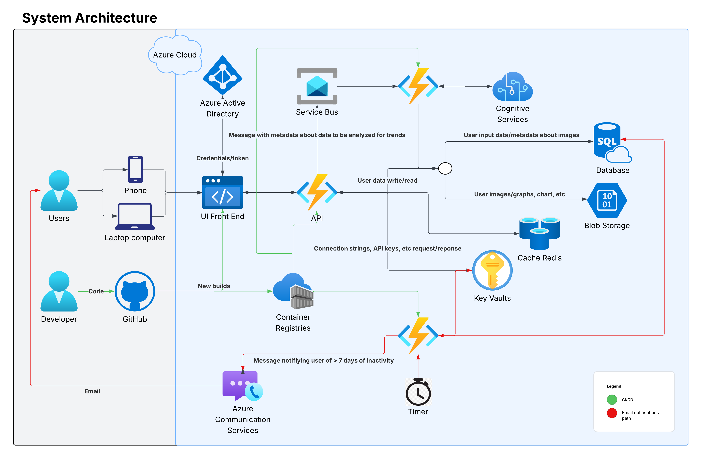
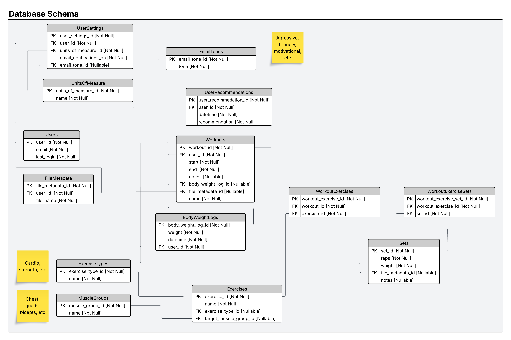

# GymPartner

## Build an application that can be accessed by users through a web browser. This gym-themed application should allow users to do the following:

- Sign-up/create an account (if new user) or login in (if existing user) 
- Log workouts
- View workout history
- View the details of individual workouts
- Upload pictures and videos (selfies, PR videos, etc)
- Track their bodyweight
- View graphs/charts of performance over a given time period
- Get AI recommendations on how to improve their current performance and predictions for 1RMs
- Receive email reminders when inactivity > 7 days. It will use aggressive threatening language to motivate the weak of heart.
- Displays all-time PRs for any given exercise.

Additionally, this application should be secure, resilient, highly-available, performant, and as low cost as possible.

